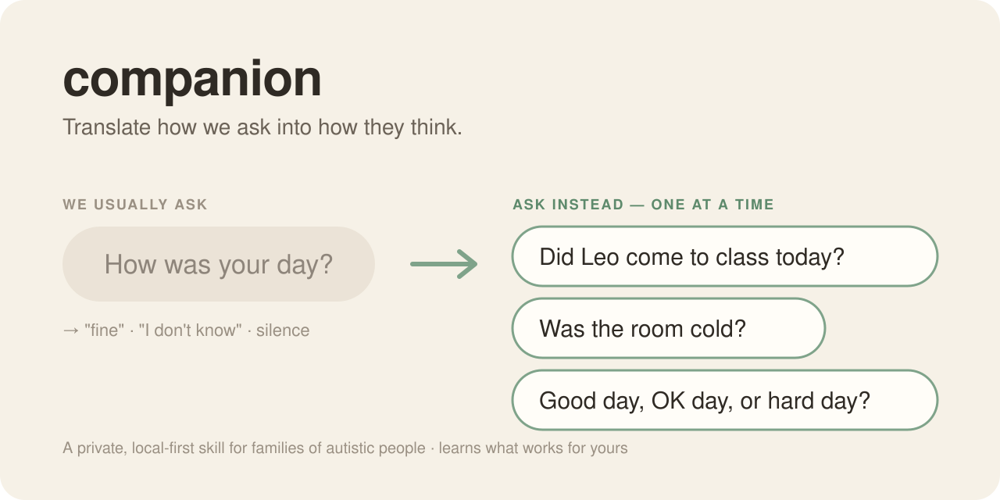
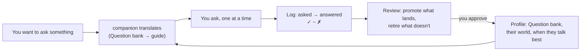

  

  
  
  
  

# companion

**A private skill that helps you talk with an autistic person you love, in the way *they* think.**

"How was your day?" asks for a summary, a judgement and a feeling all at once. You get "fine", "I don't know", or silence. It isn't that they don't want to connect. **The question didn't fit.**

companion translates the question, using what you know about *them*:

| You'd naturally say | companion suggests (one at a time) |
|---|---|
| "How was your day?" | "Did **Leo** come to class today?" → "Was the room loud or quiet?" → "Good day, OK day, or hard day?" |
| "How do you feel?" | "Is your body tired or full of energy?" → "Is it loud in here for you?" → "Pick one: 😀 😐 😣" |
| "What's wrong?" | *(Regulate first.)* Then: "Is something hurting? Yes or no." · "Is it too loud here?" |
| "Why did you do that?" | "What happened just before?" · "Was it too loud?" |
| "Maybe later." | "Not today. Saturday, yes." |
| "Are you nervous about the trip?" | "Tomorrow we fly at 9. Want to see pictures of the hotel?" |

**Feelings are reached through facts, not asked head-on.** It climbs a ladder: facts → senses → body → their own rating scale → feeling words. Many autistic people find naming emotions hard (*alexithymia*: about half of autistic adults studied; Kinnaird et al., 2019). The feeling is there; the label is hard to reach. → [The full translation guide](skill/translation-guide.md)

## What makes it different
- 🎯 **Translation is the imperative.** It never hands you back an abstract question. Every suggestion is concrete, specific and answerable, anchored in *their* world: their friends' names, their classroom, their scale.
- 🧠 **It gets better at *them*.** Every question you ask is logged with how it landed (✓ / ~ / ✗). A periodic review turns that into a personal **Question bank**: what lands, what doesn't, and when they talk best ("in the car, not at the table"). You approve every change.
- 📚 **Grounded, not invented.** Every principle traces to a [bibliography](skill/bibliography.md): double empathy (Milton), alexithymia, monotropism, and autistic voices like Higashida and Grandin. It cites its source on every suggestion and never improvises clinical advice.
- 🔒 **Private by design.** Your person's data lives in git-ignored files on your machine, and voice notes and screenshots become text locally. Your agent's language model does read those files; see [Privacy](#privacy-please-read).
- 🌍 **Speaks your family's language.** It translates the idiom, not just the words, and has a Portuguese section built in: "Daqui a pouco" is as vague as "in a minute".

## How it learns

## What it is, and what it is NOT
- ✅ A way to hold, in one place, **how to communicate with this specific person**: how they take in language, what overwhelms them, what soothes them, what lights them up. It keeps learning that from real moments.
- ✅ **Strengths first.** Built around connection and dignity, never around "fixing" anyone.
- ❌ **Not a clinical authority.** It does not diagnose, does not give medical, behavioural or therapy advice, and never invents strategies. It surfaces only what *you* and *their care team* have recorded, plus a research-grounded communication method. Otherwise it points back to the professionals. **That refusal is the safety mechanism.** Please keep it.

> "If you've met one autistic person, you've met *one* autistic person." (Stephen Shore). The shared base is **posture, never prescription**, and a person's own profile always overrides it.

## How it's built
| File | What it holds |
|---|---|
| [`skill/SKILL.md`](skill/SKILL.md) | The rules, with **the Imperative** (translate, every time) at the top |
| [`skill/translation-guide.md`](skill/translation-guide.md) | The method, the feelings ladder, and a library of translations |
| [`skill/bibliography.md`](skill/bibliography.md) | The north star. If the guide and the sources disagree, the sources win |
| [`skill/common-core.md`](skill/common-core.md) | Shared communication defaults, reusable across people |
| `skill/profile.md` | *This* person: their world, how they tell you how they feel, their Question bank. **Overrides everything generic.** |
| `skill/interaction-ledger.md` | Append-only log of real moments, including every question asked and how it landed |

## Setup
1. Copy the `skill/` folder into your OpenClaw workspace skills dir (e.g. `~/.openclaw/workspace/skills/companion/`). It's auto-discovered, with no restart.
2. `cp profile.template.md profile.md` and fill it in with your person. Start with **Their world** (names, places, routine): it's what makes the translations *theirs*. Then `cp interaction-ledger.template.md interaction-ledger.md`.
3. (Optional, macOS) build the local OCR helper so you can log from screenshots: `swiftc -O bin/ocr-vision.swift -o bin/ocr-vision`
4. Ask your agent: *"How do I ask Maya about her day?"* Afterwards, tell it what you asked and what she said; that's how it learns. You can also send a voice note or screenshot of a moment, in your private chat.

Requirements: `node` (for logging), optionally `whisper` for voice notes (`WHISPER_MODEL=small` transcribes Portuguese better) and macOS for screenshot OCR. Tests: `bash tests/run.sh`.

## Privacy (please read)
- **Your person's data is theirs.** `profile.md` and `interaction-ledger.md` are **git-ignored** by default, so you don't publish them by accident. Keep clinical reports off the repo entirely.
- Voice and screenshot understanding runs **locally** (whisper plus macOS Vision OCR). **To be plain about the rest:** the language model running your agent reads the profile and ledger. If that model is a cloud service, its provider receives them. If you need nothing to leave the device, run your agent on a local model.
- If you ever share access (a care circle), share a **non-clinical "passport"** level, not the clinical profile.
- **Consent and dignity:** the person this is about should, wherever possible, have a say in what's recorded and shared about them. Many of them are perfectly capable of it. Involve them.

## Help it grow
The translation guide gets better every time a family shares what worked.
- 💬 **[Share a translation that worked](https://github.com/antonioernestowanderley-netizen/companion-skill/issues/new?template=translation-that-worked.md)**, de-identified. One good question can help thousands of families.
- 📚 **[Suggest a source](https://github.com/antonioernestowanderley-netizen/companion-skill/issues/new?template=source-suggestion.md)**: autistic-authored and peer-reviewed work especially.
- ⭐ If this helps your family, star the repo so other families can find it.

Aggregating real usage across families to find broader commonalities is powerful, and it touches **vulnerable people's data**. Don't do it casually. The bar is explicit consent, de-identification, and partnership with the autistic community and clinicians. That care isn't friction; it's what makes this trustworthy.

## License
MIT. See [LICENSE](LICENSE). Provided as-is, with no warranty, and **no clinical claims of any kind.**
